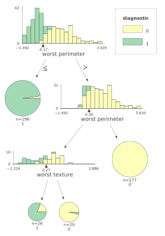
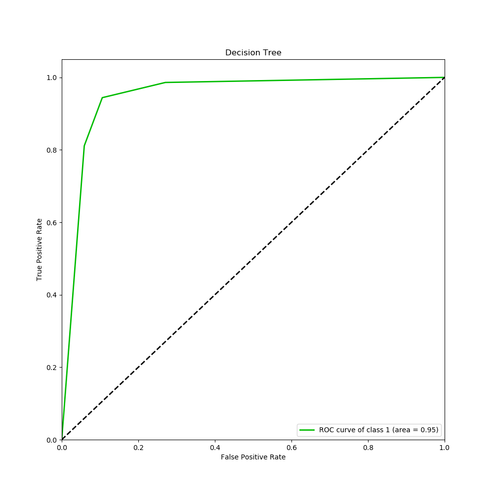
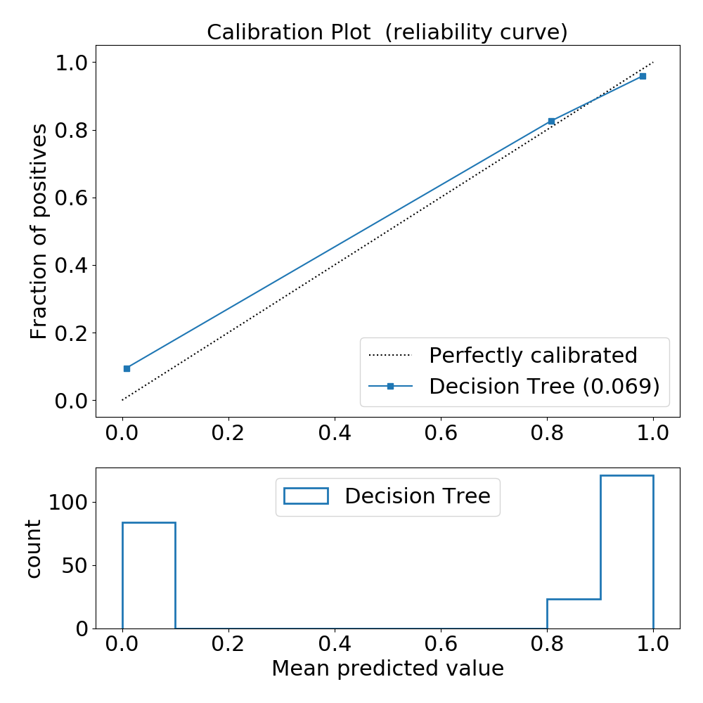
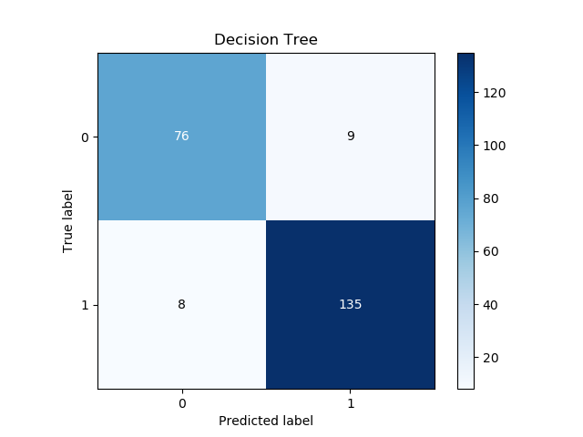

# MLFramework

## Python machine learning framework

This is a developing version and the following algorithms have already implemented:

- Scikit-learn:
    - Logistic Regression (lr)
    - Decision Tree (dt)
    - Random Forest (rf)
    - Support Vector Machine (svm)
    - Artificial Neural Network (ann)

- XGboost (xgb)

### How to start

Best practices is to create a Python environment and install the required packages:

```python
python3 -m pip install --user virtualenv # if you do not have the virtualenv
git clone https://github.com/dtiezzi/MLFramework.git
cd MLFramework
which python
virtualenv --python"/path/to/your/python/path" env
source env/bin/activate
python -m pip install -r requirements.txt
```

You have to move your CSV file into the `static` folder. Then, in order to run the ML pipeline:

```python
python main.py
```

You can use the Scikit-learn breast cancer sample dataset as an example. The pipeline outputs accuracy graphs and records.

When running the Decision Tree algorithm, the the decision tree plot is created:



All algorithms save a ROC curve, a Reliability plot and the Confusion Matrix:


</br>
*Calibration Plot:*

</br>
*Confusion Matrix:*


Plots are saved into `reports/graphs` folders. Your models and the accuracy report are saved in `reports/models` and `reports/txtfiles`, respectively.